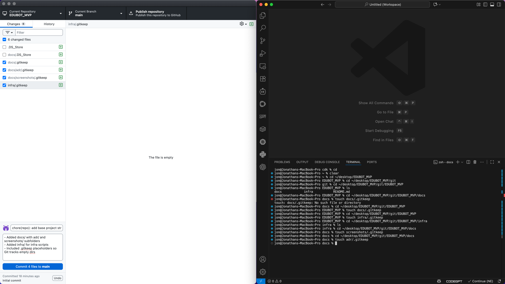
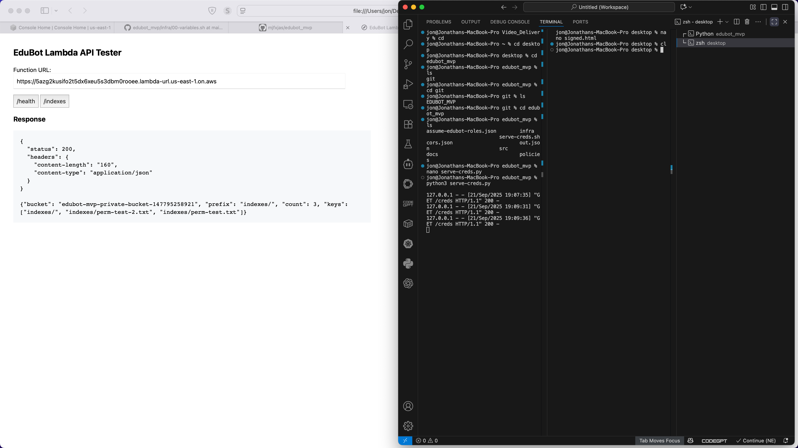
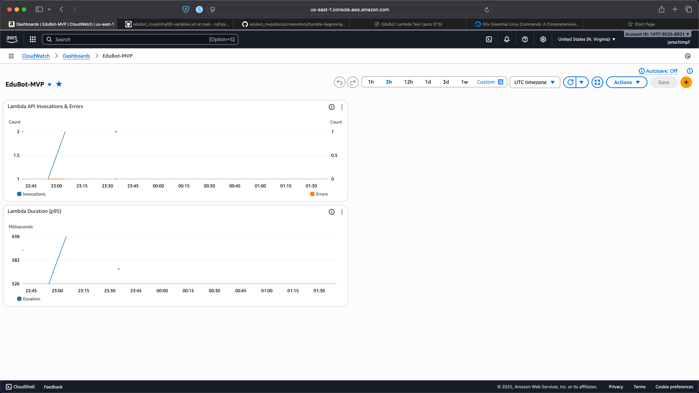

# Dev Journal – EduBot MVP

## 2025-09-20
- Created base repo structure (docs/, infra/, adr/, screenshots/)
- Committed initial .gitkeep placeholders
- Added screenshot documenting repo structure
- Added dev-journal.md and documented process

Commit: 7927d5c

## 2025-09-20
- Added infra/00-variables.sh for project-wide constants
- Added infra/20-vpc.sh to create private VPC, subnet, SG, route table

Commit: 3f969e2

## 2025-09-20
- Added KMS + S3 hardening script; verified SSE-KMS, public-block, TLS-only

Commit: 5bbcb51

## 2025-09-20
- Added infra/30-vpc-endpoints.sh (creates VPC endpoints for S3 + KMS)

Commit: dcb08d7

## 2025-09-20
- Verified endpoints (available) and S3 route in route table

Commit: 3a79ebb

## 2025-09-21
- Completed hardened storage layer: 
  - S3 bucket: `edubot-mvp-private-bucket-147795258921`
  - KMS key: `alias/edubot-mvp-kms`
  - Policies: BlockPublicAccess, TLS-only, SSE-KMS default

- IAM scaffolding:
  - Roles: `edubot-app-lambda`, `edubot-indexer-ecs`, `edubot-indexer-exec`
  - Customer-managed policies: `edubot-app-s3-kms`, `edubot-indexer-s3-kms`
  - Tested assume-role path (user → role) and validated S3/KMS op

SPRINT 1 Complete: Infrastructure in place and verified working! 

Commit: cbcf0e9

## 2025-09-21

## Sprint 2 – Lambda API Skeleton
- Built Python Lambda container (3.12) with /health and /indexes
- Pushed to ECR (v0.5, Docker schema v2 single-manifest)
- Deployed Lambda in custom VPC (subnet subnet-057efaedf3ada76f0, SG sg-0b8487a7295172c71)
- Attached AWSLambdaVPCAccessExecutionRole for ENI permissions
- Created Function URL (IAM-only) and verified S3 access to indexes/

Commit: cbcf0e9

## 2025-09-21

### Sprint 2 – Lambda API Skeleton (cont.)
- Fixed Lambda CreateFunction errors (`CreateNetworkInterface` + ECR manifest issue) by:
  - Granting execution role EC2 network interface permissions
  - Rebuilding Docker image with `--platform linux/amd64` to produce Docker v2 manifest
- Successfully deployed Lambda function `edubot-api-fn` from ECR
- Verified health check (`/health`) and S3 index listing (`/indexes`) via `aws lambda invoke`
- Configured and tested Lambda Function URL (IAM-only)
- Built **local browser tester** (`signed.html`) for IAM-signed requests
- Added **serve-creds.py/serve-creds.sh** utilities to expose STS creds locally for browser testing
- Organized repo:
  - Moved helper scripts into `tools/local/`
  - Moved test artifacts (e.g., `signed.html`) into `tools/local/`
- Captured screenshot of working `/indexes` call and IAM-signed test page for documentation

Commit: e7477b6 

## 2025-09-21
- Created cloudwatch dashboard and set log retenion to 14 days, verified and screenshots

Commit: 4fa62a4

## 2025-09-21
- Created S3 bucket `edubot-mvp-147795258921-us-east-1-curriculum` (us-east-1)
- Hardened bucket: public-block + default SSE-KMS (`alias/edubot-mvp-kms`)
- Uploaded seed textbooks:
  - philosophy/philosophy-textbook.pdf
  - history/history-textbook.pdf

Commit: 
